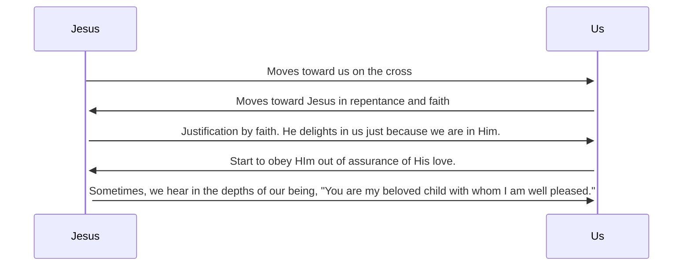

> #Mark 1:14

Mark here is comparing Adam in the Creation of the world, with Jesus at the re-creation of the world, where he begins to describe how Jesus brings us into the dance. 

| Adam | Jesus |
| ---- | ---- |
| After Spirit moves across the face of the water and God speaks things into being, Adam Experiences tempatation, Satan, and trial | After inaugeration of the new creation, he comes out of the water, the spirit moves upon HIm, and Jesus experiences temptation, Satan and trial. |
| In a garden | In the wilderness |
| 1st Adam | 2nd Adam |
| With animals in harmony with humans | With the wild beasts (Had an infinitely harder path to trod... the assault doesn't stop here.) |
| **God Told**: "Obey me about the tree" (becuase God invented us to orbit around him)  **Adam**: Why? (God says just because I say so. Satan encourages the failure by saying that the idea of self-giving love where you orbit around someone else vulnerably will never work.) We're also afraid of trusting God like that, and satan still speaks...  Our relationships blow up because we all insist that everything has to revolve around me.  | **God Told**: "Obey me about the tree" (but this time, the tree is a cross) |
| Obey and you will live, and Adam didn't. | Obey me about the tree and I'll crush you to powder, and Jesus did. |

By doing this, Jesus brings us into the dance...

We cannot survive if we are not part of this dance. 

**If creation and redemption is the project of the triune God, it means 3 things:** 
1. **Wait for Him in Community**. You're never going to come to grips with a God like this unless you are part of a community. you can only know a God that is a community unless you are in a community. 
2. **Praise Him thoroughly**. Don't let petitions squeeze out praise in your prayer life. If God is a community of beings who have so much joy in mutually self-giving love, that basically we are all rejoiced into being. Praise and joy is what life is about. For what he's done, we'll find that we'll become an affirming person. "Praise is inner health made audible" - #CSLewis
3. **Obey Him Unconditionally. Give your life to Jesus even if it brings problems.** Only in #Mark does it say that Jesus is with the wild beasts. At the time of this gospel, they were being thrown to wild beasts. 